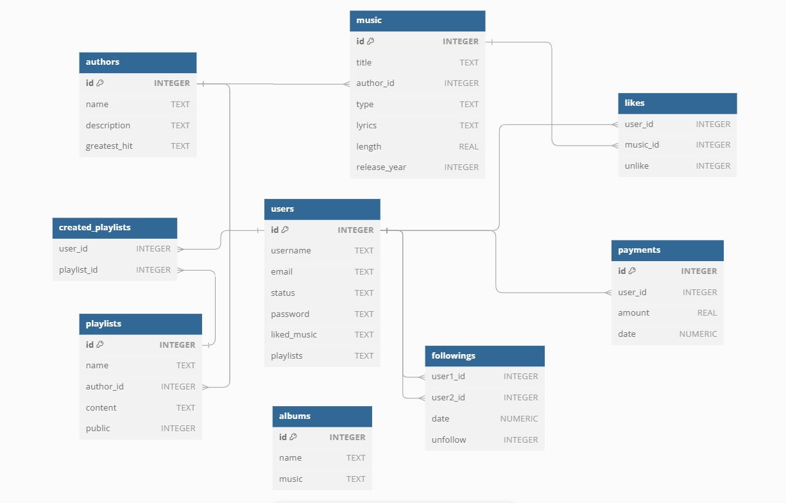

# Design Document

By YOUR NAME HERE Mikołaj

Video overview: [<URL HERE>](https://www.youtube.com/watch?v=CXXl0W-IH7M)

## Scope

In this section you should answer the following questions:

* What is the purpose of your database?
* Which people, places, things, etc. are you including in the scope of your database?
* Which people, places, things, etc. are *outside* the scope of your database?

The purpose of the database is to manage and store information related to the Spotify application, including data about users, music content, and user interactions with that content. The database aims to provide efficient storage and retrieval of data to support core functionalities. My database is including scope of given entities: users, artists, music tracks, albums, playlists, payments, followers, favourites songs. Outside the scope of my database are Advertising Data, Geographic Locations, Non-Music Content and Employee data.

## Functional Requirements

In this section you should answer the following questions:

* What should a user be able to do with your database?
* What's beyond the scope of what a user should be able to do with your database?

User in my database should be able to Easily find informations about songs and artists, Create and manage an account, Interact with music content, Create and manage a plalitsts, Follow other users, Make a payment and Upload music. In other way user should not be able to find informations about Employye data and Interact with other user's data.

## Representation

### Entities

In this section you should answer the following questions:

* Which entities will you choose to represent in your database?
* What attributes will those entities have?
* Why did you choose the types you did?
* Why did you choose the constraints you did?

I choosed to represent following entities: User, Author, Music, Album, Playlist, Payment, Follow, Like, Created_playlist.
User's attributes are id, username, e-mail, status, password, liked_music, playlists.
Author's attributes are id, name, description, greatest_hit.
Music attributes are id, title, author_id, type, lyrics, length, release_year.
Album's attributes are id, name, music.
Playlist's attributes are id, name, author_id, content, public.
Payment's attributes are id, user_id, amount, date.
Follow's attributes are user1_id, user2_id, date, unfollow.
Like's attributes are user_id, music_id, unlike.
Created_playlist's attributes are user_id, playlist_id.
Types that i choosed are: Primary Keys to uniquely identify each record. Foreign Keys to establish relationships between tables. Time Stamps to insert current date into a record. Default to get a given value even if someone forget to insert value in this column. Real to get a real number value. Triggers that will automatically execute a certain events occur within my database.
Constraints that i choosed are: Check contraints, to check that given value is in set. Not null contraints to prevent to give a null value.

### Relationships

In this section you should include your entity relationship diagram and describe the relationships between the entities in your database.

## Optimizations

In this section you should answer the following questions:

* Which optimizations (e.g., indexes, views) did you create? Why?

For optimization I created two indexes one for finding authors by their names and another for finding titles in songs released after 2020.

## Limitations

In this section you should answer the following questions:

* What are the limitations of your design?
* What might your database not be able to represent very well?

Limitations of my design are that I can't store Video
While the database design captures the core functionalities of a music streaming application, there are limitations in handling complex user interactions, detailed content management and Video presentation.
